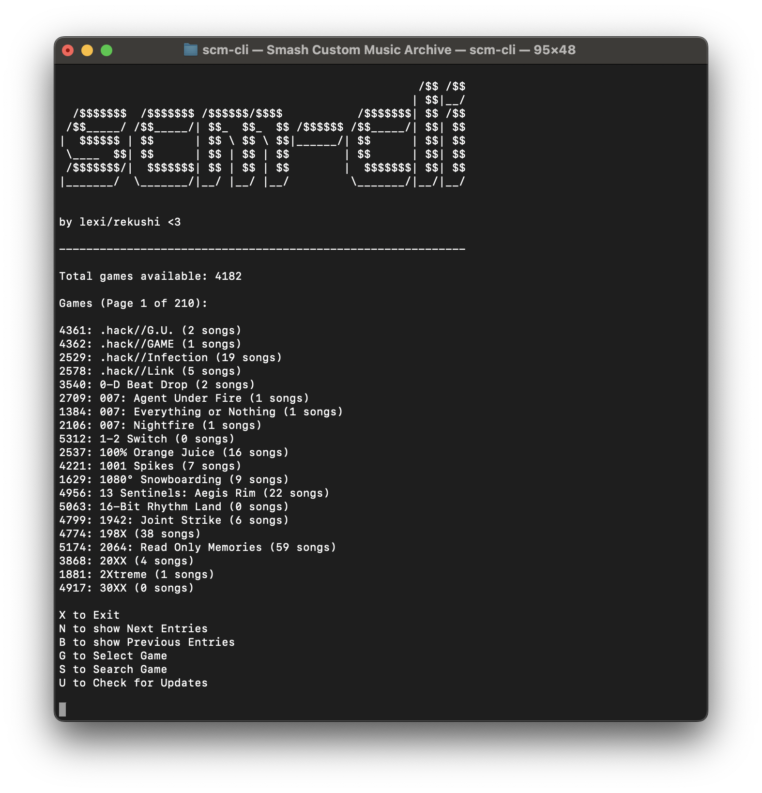

<div align="center">
  <a href="https://github.com/RekuNote/scm-cli/">
    
  </a>

  <h3 align="center">scm-cli</h3>

  <p align="center">
    scm-cli is a terminal client for downloading BRSTM files from Smash Custom Music Archive (smashcustommusic.net)
    <br />
    © RekuBuild 2024
    <br />
    <br />
  </p>
</div>

## Table of Contents

- [Features](#features)
- [Screenshots](#screenshots)
- [Requirements](#requirements)
- [Installation](#installation)
- [Usage](#usage)
- [Options](#options)
- [Examples](#examples)
- [License](#license)

## Features

- Supports Linux and macOS only. For Windows, use <a href="https://github.com/RekuNote/scm-py">scm-py</a>.
- Search for games by name.
- List all available games and their corresponding IDs.
- Search for songs by game ID.
- Download BRSTM (or other) files by song ID.
- Specify output path for downloads.

## Screenshots



## Requirements

- `jq` is required for JSON parsing. (When ran, scm-cli will automatically check for `jq` and prompt to install if not found.)

## Installation

### Method 1 - [nv](https://github.com/RekuNote/nv) (Recommended)
<i>Note - This method only works on Debian-based systems (like Ubuntu). For any other Linux distro or macOS, use Method 2.</i>

<br>

Install nv with it's installer command:

```sh
curl -sSL https://raw.githubusercontent.com/RekuNote/nv/main/install.sh | sudo bash
```

Install `scm-cli` with `nv` if not already:

```sh
sudo nv update && sudo nv install scm-cli
```
<br>

### Method 2 - scm-cli installer script

<br>

Run the install command:<br>
```sh
curl -sL https://raw.githubusercontent.com/RekuNote/scm-cli/main/install.sh | bash
```

<br>

### Method 3 - Running scm-cli portably

<i>If neither Method 1 or 2 work, you can run scm-cli portably by:</i>

<br>

- Downloading the `scm-cli` file
- Allowing execute permissions:
```sh
chmod +x scm-cli
```
- Running the program:
```sh
./scm-cli
```

<br>

## Usage

Run scm-cli:

```sh
scm-cli
```

<br>

### Options

- `-u, --update`               Checks for updates

<br>

## Examples

- Run scm-cli normally:

```sh
scm-cli
```

- Update to the latest version:

```sh
scm-cli --update
```

## License

This project is licensed under a modified version of the MIT License.
