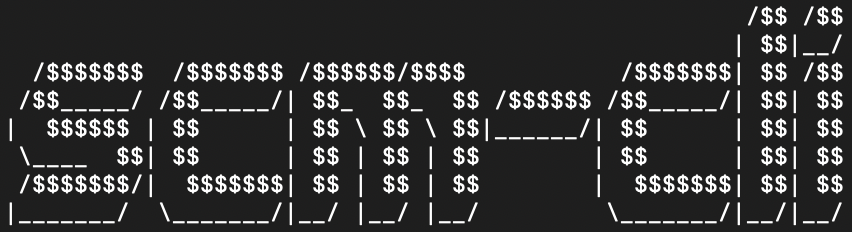

<div align="center">
  <a href="https://github.com/RekuNote/scm-cli/">
    
  </a>

  <h3 align="center">scm-cli</h3>

  <p align="center">
    scm-cli is a terminal client for downloading BRSTM files from Smash Custom Music Archive (smashcustommusic.net)
    <br />
    © RekuBuild 2024
    <br />
    <br />
  </p>
</div>

## Table of Contents

- [Features](#features)
- [Requirements](#requirements)
- [Installation](#installation)
- [Usage](#usage)
- [Options](#options)
- [Examples](#examples)
- [License](#license)

## Features

- Supports Linux and macOS only.
- List all available games and their corresponding IDs.
- Search for songs by game ID.
- Download BRSTM (or other) files by song ID.
- Specify output path for downloads.

## Requirements

- `jq` is required for JSON parsing. (When ran, scm-cli will automatically check for `jq` and prompt to install if not found.)

## Installation

Run the install command (this command can also be used to update):<br>
`curl -sL https://raw.githubusercontent.com/RekuNote/scm-cli/main/install.sh | bash`

<br>
If this doesn't work, run scm-cli portably by:

- Downloading the `scm-cli` file
- Allowing execute permissions:
`chmod +x scm-cli`
- Running the program:
`./scm-cli`

## Usage

Run scm-cli:

```sh
scm-cli
```

### Options

- `-u, --update`               Updates to latest version

## Examples

- Run scm-cli normally:

```
scm-cli
```

- Update to the latest version:

```sh
scm-cli --update
```

## License

This project is licensed under a modified version of the MIT License.
